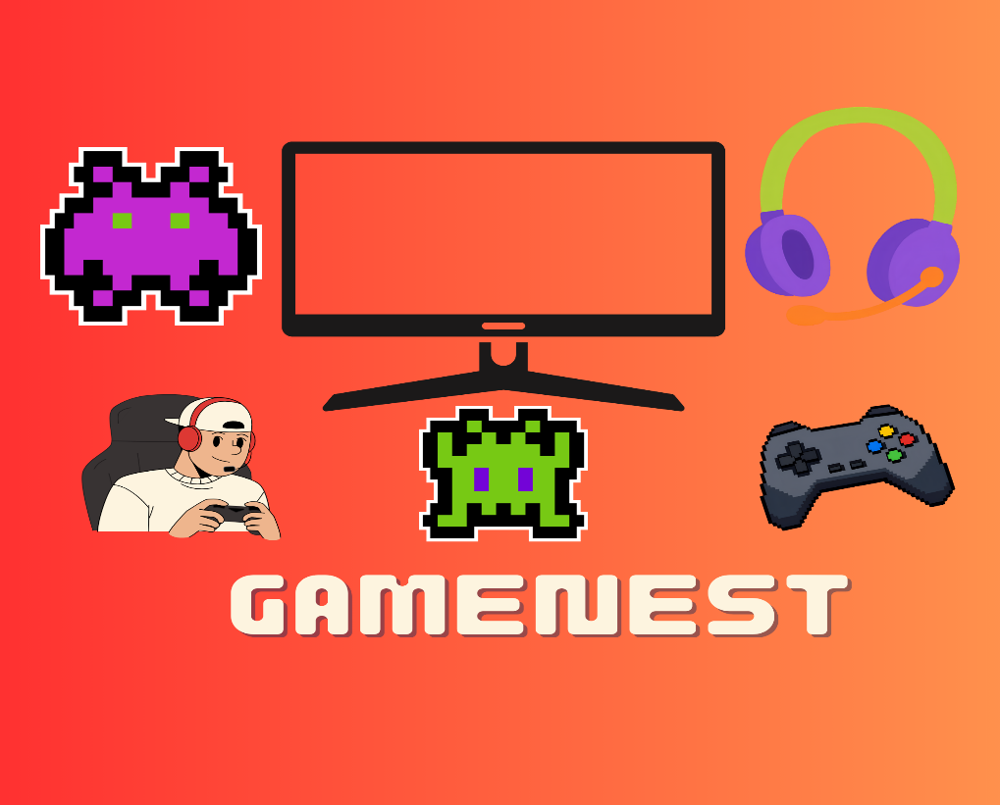
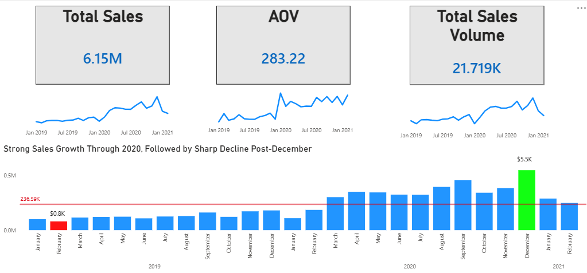
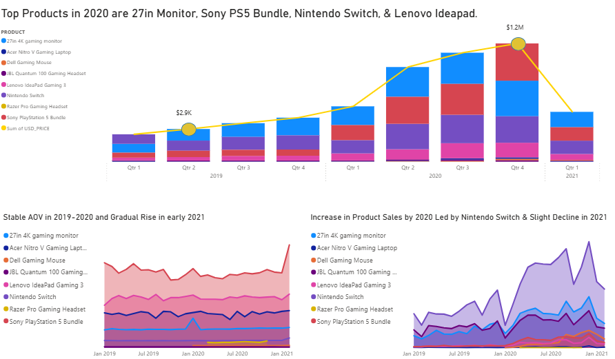
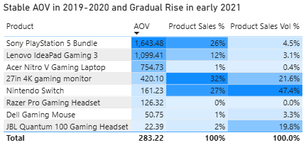
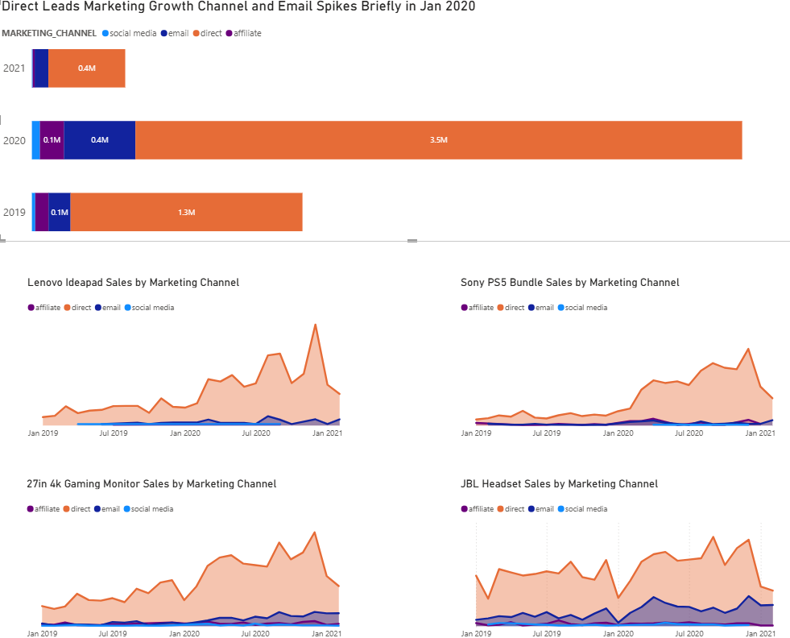

{width="4.5993055555555555in"
height="3.0520833333333335in"}

**Client Background**

GameNest is an E-commerce company specializing in gaming peripherals
such as mice, headsets, monitors, PlayStation, and accessories. It was
established in 2018 and quickly position itself as a trusted shop for
gamers seeking quality and competitively priced products.

**Business Objectives**

As GameNest continues to expand, the team aims to strengthen data driven
decision making and want to uncover *Sales Trends*, *Product
Performance*, *Regional Dynamics*, and *Marketing Channel
Effectiveness*.

**Executive Summary**

{width="6.947916666666667in"
height="2.821527777777778in"}

**Sales Insights**

1.  **Sales Growth**

- **Overall Growth:** Total sales reached an outstanding 6.15M with
  21.7K orders. Remarkable increase of 204% in sales for 1 year but
  after a month, 47% decrease due to Holiday Event or Promotions.

- **Peak Performance:** December 2020 recorded the highest monthly sales
  (\$5.5K), marking the culmination of two years of growth.

- **Decline:** After December 2020, sales dropped sharply, with early
  2021 figures falling below the average sales (236.59K reference).
  Despite the fact that the Total Sales and Volume have been declined,
  the Average Order Value continue to show a steady upward trend,
  reflecting stronger demand for higher value products.

2.  **Trend Analysis**

- **2019:** Modest beginnings, with February 2019 at only 0.8K.

- **2020:** Consistent upward trajectory, fueled by increased demand for
  gaming peripherals due to the COVID seasons and indicating a global
  market trend.

- **2021:** Clear downturn, indicating either market saturation, reduced
  consumer spending, or weaker marketing push.

3.  **Seasonal Trends**

- **Holiday Season Impact:** Q4 (especially December) consistently
  outperformed other months, confirming strong seasonality.

- **Mid-Year Plateau:** Sales between Q2--Q3 were relatively stable but
  lower, suggesting weaker demand outside promotional periods.

- **Campaign Sensitivity:** Spikes align with promotional events (e.g.,
  holiday sales), showing reliance on seasonal campaigns.

4.  **Recommendation**

- **Inventory & Supply Chain:** Increase stock of high-demand products
  before Q4 to maximize holiday sales.

- **Marketing Strategy:** Launch mid-year campaigns (summer gaming
  bundles, back-to-school promotions) to reduce reliance on Q4 spikes.

- **Product Focus:** Identify which products and categories (headsets,
  monitors, device) drove December 2020's peak and replicate success
  with new launches.

- **Customer Retention:** Introduce loyalty programs or subscription
  models to sustain engagement beyond seasonal peaks.

{width="6.5in"
height="3.796527777777778in"}**Product Performance**

{width="3.591978346456693in"
height="1.7084809711286089in"}

1.  **Overall Findings**

    - **Sales Distribution:** The product mix shows a strong
      concentration in a few high-performing items: **27in 4K Gaming
      Monitor** and **Nintendo Switch** together account for 59% of
      total sales and 69% of total volume.

    - **AOV Behavior:** The Average Order Value (AOV) remained stable
      through 2019--2020 and began rising in early 2021, signaling a
      shift toward higher-value purchases.

    - **Revenue Drivers:** Premium products like the **Sony PlayStation
      5 Bundle** and L**enovo IdeaPad Gaming 3** contributed
      significantly to revenue despite lower sales volume.

2.  **Best Performing Products**

- **27in 4K Gaming Monitor** -- Highest sales share (32%) and strong
  volume (22%). Affordable yet high-demand item for PC gamers.

- **Nintendo Switch** - Dominated volume (47%) and maintained solid
  sales share (27%). Excellent mass-market appeal.

- **Sony PS5 Bundle** - Premium product with highest AOV (1,643.48).
  Drove 26% of total sales despite only 4% volume.

3.  **Underperforming Products**

- **Acer Nitro V Laptop** - Low sales (1%) and negligible volume. Poor
  competitiveness in mid-range laptop segment.

- **Razer Pro Gaming Headset** -- 0.003% sales and volume, likely
  outdated or poorly marketed.

- **Dell Gaming Mouse** - Low AOV and minimal contribution to revenue.

- **JBL Quantum Headset** - Decent volume (20%) but low AOV (22.39).
  High quantity, low profitability.

4.  **Key Observations & Recommendation**

- **Diversify Product -** Introduce mid-range laptops and accessories
  better value propositions.

- **Inventory Strategy --** Prioritize stock for the top performing
  products before holiday peaks and reduce low turnover accessories or
  products

- **Marketing Optimization --** Maintain strong Q4 campaigns, add
  recurring sales (Pay Day, Flash Deals, and Double-Date Sales) and
  align campaigns with local holidays and mega events (Back to school
  Promo, Black Friday, and mid-year sales).

**Marketing Performance**

{width="6.5in"
height="5.247222222222222in"}

1.  **Channel-Level Performance**

- **Direct Marketing**

<!-- -->

- Direct has been consistently the main driver of marketing channel
  sales, contributing to 80-85% of overall share across the years.

- The top products have a steady increase of performance on Channel
  indicating its consistency especially on **Sony PS5 Bundle.**

- Grew from **1.3M in 2019 to 3.5M in 2020** (169% increase)**.**

<!-- -->

- **Email Marketing**

<!-- -->

- Noticeable spike in **Jan 2020 (0.4M)**, outperforming social media
  and affiliate highlighting its potential growth

- **JBL Headset** and **27in 4k Gaming Monitor** have a great
  performance on the channel compare to the other top products.

<!-- -->

- **Affiliate & Social Media Marketing**

<!-- -->

- The two marketing channels combine contribute for only \<10% of
  overall performance

- Investigate further the promotions on the channel and cut off budget
  since their performance were relatively low for the timeline.

2.  **Key Observation and Recommendation**

- **Diversify Channel Strategy**

<!-- -->

- Reduce dependency on Direct by scaling Email (automation,
  personalization) and revitalize social media (influencer partnerships,
  target ads).

<!-- -->

- **Product Specific Marketing**

<!-- -->

- Continue leveraging direct and boost Email Marketing for its potential
  growth with other products
